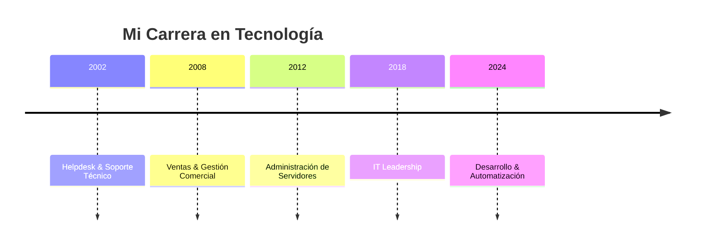

# 👋 ¡Hola! Soy Fabio Andrés Arias Osorio 
## 🚀 También conocido como **Mr Fbo**

<div align="center">
  
</div>

---

## 🧑‍💼 **Sobre Mí**

🎯 **IT Leader** con más de **22 años de experiencia** en el mundo de la tecnología  
💼 Administro infraestructuras de TI para múltiples empresas  
🌱 Actualmente estudiando **idiomas** y perfeccionando mis habilidades en **programación**  
🚀 Desarrollando webapps, automatizaciones y soluciones tecnológicas innovadoras  
✝️ **Cristiano**, casado y padre de 2 hijos maravillosos  
🌍 **Viajero** apasionado por conocer nuevas culturas y sabores  

---

## 💼 **Mi Trayectoria Profesional**



**🔧 Experiencia en:**
- 🎧 **Helpdesk & Soporte Técnico** - Resolución de incidencias y atención al cliente
- 💰 **Ventas Tecnológicas** - Comercialización de soluciones IT
- 🖥️ **Administración de Servidores** - Gestión de infraestructura crítica
- 👨‍💼 **Liderazgo IT** - Dirección de equipos técnicos en múltiples empresas
- 🏗️ **Gestión de Infraestructura** - Diseño y mantenimiento de sistemas empresariales

---

## 🛠️ **Stack Tecnológico**

### 🎯 **Actualmente Aprendiendo**


### 🤖 **Explorando**


### 🌐 **Idiomas en Progreso**
🇺🇸 **Inglés** | 🇫🇷 **Francés** | 🇩🇪 **Alemán**

---

## 🚀 **Proyectos Actuales**

```python
class FabioArias:
    def __init__(self):
        self.nombre = "Fabio Andrés Arias Osorio"
        self.alias = "Mr Fbo"
        self.experiencia = "22 años en Tech"
        self.enfoque_actual = [
            "Desarrollo de WebApps empresariales",
            "Automatización de procesos",
            "Liderazgo IT",
            "Aprendizaje continuo"
        ]
    
    def mision(self):
        return "Transformar ideas en soluciones tecnológicas innovadoras"
```

🎯 **En qué estoy trabajando:**
- 💻 Desarrollo de **aplicaciones web** para empresas
- 🤖 Creación de **automatizaciones** para optimizar procesos
- 🏢 **Liderazgo IT** en múltiples organizaciones
- 📚 **Formación continua** en nuevas tecnologías

---

## 📊 **Estadísticas de GitHub**

<div align="center">
  
  
</div>

<div align="center">
  
</div>

---

## 🌐 **Mis Empresas & Proyectos**

🏢 **Sitios Web:**
- 🌟 [**FabioNet**](https://www.fabionet.com) - Soluciones tecnológicas integrales
- 🔧 [**Asesoría ProTech**](https://www.asesoriaprotech.com) - Consultoría especializada en IT

---

## 📫 **¡Conectemos!**

<div align="center">

[](mailto:fabioarias@fabionet.com)
[](https://www.linkedin.com/in/fabioariasit)
[](https://wa.me/573003966145)

</div>

---

## 🎨 **Un Poco Más Sobre Mí**

```yaml
Pasiones:
  - 🌍 Viajar y conocer nuevas culturas
  - 🍽️ Disfrutar de la buena comida
  - 👨‍👩‍👧‍👦 Tiempo de calidad en familia
  - 📚 Aprendizaje continuo
  - ✝️ Fe y crecimiento espiritual

Estado_Actual:
  - 💼 IT Leader en múltiples empresas
  - 🎓 Estudiante eterno de tecnología
  - 👨‍💻 Desarrollador en crecimiento
  - 🌱 Siempre aprendiendo algo nuevo
```

---

<div align="center">
  
</div>

<div align="center">
  <h3>💝 ¡Gracias por visitar mi perfil! 💝</h3>
  <p><em>"La tecnología es mejor cuando une a las personas"</em> 🚀</p>
</div>

---

<div align="center">
  
</div>
