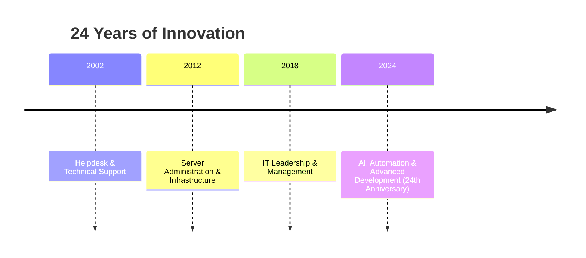

#  👋 I'm Fabio Andrés Arias Osorio (Mr Fbo)

<div align="center">
  
</div>

---

### 🌐 [ES] / [EN]
> **ES:** Líder de TI con 24 años de trayectoria, transformando negocios a través de la tecnología.
> **EN:** IT Leader with 24 years of experience, transforming businesses through technology.

---

## ⚡ Quick Status / Estado Rápido
- 🔭 **Working on:** [Academy](https://github.com/MrFabioArias/academy) & [TodoList](https://github.com/MrFabioArias/todolist)
- 🧠 **Mastering:** Python, AI Integration, & Advanced Automation.
- 💬 **Ask me about:** IT Infrastructure, Full-stack Dev, & Tech Strategy.
- 📫 **How to reach me:** [fabioarias@fabionet.com](mailto:fabioarias@fabionet.com)

---

## 🏆 GitHub Trophies
<div align="center">
  
</div>

---

## 🛠️ CyberStack & Skills
<div align="center">
  
</div>

<br>

<div align="center">
  
</div>

---

## 🚀 Featured Projects / Proyectos Destacados
<div align="center">

| Project | Description (EN) | Descripción (ES) |
| :--- | :--- | :--- |
| [**Academy**](https://github.com/MrFabioArias/academy) | Educational platform for internal training. | Plataforma educativa para capacitación interna. |
| [**TodoList**](https://github.com/MrFabioArias/todolist) | Advanced productivity & task management system. | Sistema avanzado de productividad y gestión de tareas. |
| [**FabioNet**](https://www.fabionet.com) | IT Infrastructure & Professional Services. | Infraestructura de TI y Servicios Profesionales. |

</div>

---

## 📊 Performance Metrics
<div align="center">
  
  
</div>

---

## 🗺️ Career Timeline


---

## 🎨 About Me / Sobre Mí
```yaml
identity:
  name: Fabio Andrés Arias Osorio
  alias: Mr Fbo
  faith: Christian ✝️
  passions: [Family 👨‍👩‍👧‍👦, Travel 🌍, Tech Learning 📚]

skills_evolution:
  python: Advanced
  ai_automation: Expert
  languages: [English 🇺🇸, French 🇫🇷, German 🇩🇪]
```

---

<div align="center">
  
</div>

<div align="center">
  
</div>

---

<div align="center">
  <p><em>"Technology is best when it brings people together"</em> 🚀</p>
  <p><strong>© 2026 Mr Fbo</strong></p>
</div>
