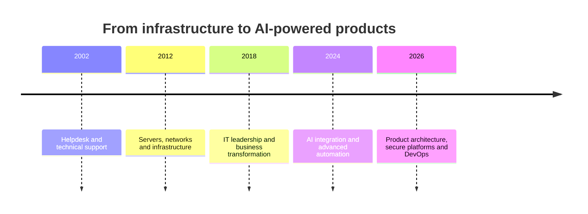

# Fabio Andrés Arias Osorio · Mr Fbo

### IT Leader · Full-stack Developer · AI & Automation Builder

**24 years turning technology into reliable business systems.**  
**24 años convirtiendo tecnología en sistemas confiables para empresas.**

## About me / Sobre mí

> **ES:** Líder de TI, desarrollador y emprendedor. Diseño y opero soluciones que conectan software, infraestructura, automatización e inteligencia artificial para resolver procesos reales de negocio.
>
> **EN:** IT leader, developer, and entrepreneur. I design and operate solutions that connect software, infrastructure, automation, and artificial intelligence to solve real business workflows.

- Building at the intersection of **product, architecture, DevOps, security, and operations**.
- Focused on maintainable systems: modular design, tested contracts, observable services, and safe delivery.
- Most client and production repositories are **private by design**; this profile shares capabilities without exposing customer data.

## What I build / Lo que construyo

| Area | Work |
| --- | --- |
| Business platforms | CRM, operations, inventory, maintenance, metrology, reporting, and internal portals |
| Learning products | Corporate training, courses, assessments, certificates, and progress analytics |
| AI & automation | Assistants, document intelligence, workflow automation, email/security analysis, and integrations |
| Web products | Next.js applications, PWAs, dashboards, APIs, public sites, and role-based administration |
| Infrastructure | Dockerized services, self-hosting, networks, monitoring, backups, and secure remote operations |

## Current stack / Stack actual

  

| Layer | Tools and practices |
| --- | --- |
| Frontend | TypeScript, React, Next.js, Vite, Tailwind CSS, accessible responsive UI |
| Backend | Python, Django, FastAPI, Node.js/Express, PHP, REST APIs, background jobs |
| Data | PostgreSQL, Prisma, SQLAlchemy, MySQL, Redis, versioned migrations |
| Platform | Docker, GitHub Actions, GHCR, Coolify, Linux, AWS, health checks and rollback |
| Quality | Pytest, Vitest, integration/E2E testing, Ruff, ESLint, type checking, Dependabot |

## Selected live work / Proyectos en línea

- [**ProTech Academy**](https://academy.asesoriaprotech.com) — corporate learning for cybersecurity, productivity, and AI.
- [**AsesoríaProTech**](https://asesoriaprotech.com) — AI, security, training, and business platforms.
- [**FabioNet**](https://www.fabionet.com) — technology infrastructure and professional services.
- [**Paantec**](https://paantec.com) — public web experience for vertical-transport solutions.

Private product work also covers operations, CRM, maintenance, document management, analytics, inventory, and AI assistants.

## 2026 engineering focus

- Production-grade AI integrations with clear security and failure boundaries.
- Modular full-stack architecture for systems that can evolve without rewrites.
- Consistent CI/CD, dependency security, branch governance, and container delivery.
- Incremental modernization of Python, TypeScript, JavaScript, and PHP applications.
- Better observability, migration safety, backup verification, and rollback.

## Career timeline / Trayectoria

```mermaid
timeline
    title From infrastructure to AI-powered products
    2002 : Helpdesk and technical support
    2012 : Servers, networks and infrastructure
    2018 : IT leadership and business transformation
    2024 : AI integration and advanced automation
    2026 : Product architecture, secure platforms and DevOps
```

## Let’s connect / Contacto

- Email: [fabioarias@fabionet.com](mailto:fabioarias@fabionet.com)
- Technology services: [fabionet.com](https://www.fabionet.com)
- Business platforms and consulting: [asesoriaprotech.com](https://asesoriaprotech.com)

“Technology is best when it brings people together.”

**© 2026 Mr Fbo**

